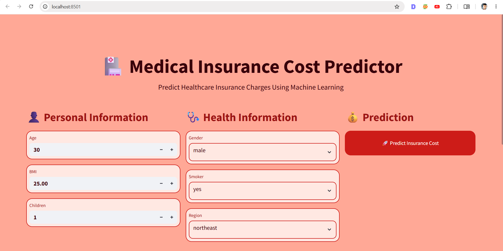
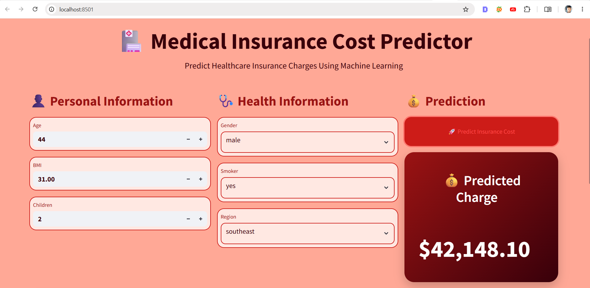
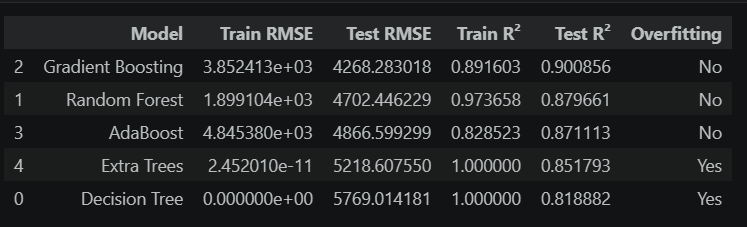

# 🏥 Medical Insurance Cost Predictor

A Machine Learning-powered web application that predicts healthcare insurance charges based on personal and health-related information.

### 🚀 Live Application

🔗 **Live Demo:**
[Healthcare Insurance Cost Predictor](https://healthcare-insurance-cost-predictor-ml.streamlit.app/)

Direct URL:

```text
https://healthcare-insurance-cost-predictor-ml.streamlit.app/
```

---

## 👨‍💻 Developer

**Sumit Naresh Ghodke**

🔗 **LinkedIn Profile:**
[Connect on LinkedIn](https://www.linkedin.com/in/sumit-ghodke-a45a82205/)

Direct URL:

```text
https://www.linkedin.com/in/sumit-ghodke-a45a82205/
```

---

# 📸 Application Preview

## Main Dashboard



---

## Prediction Dashboard



---

# 📖 About The Project

Healthcare insurance premiums are influenced by several factors such as age, body mass index (BMI), smoking habits, family size, and geographical region.

This project leverages Machine Learning Regression Algorithms to estimate insurance charges based on user inputs. The application provides an interactive and user-friendly interface where users can instantly obtain a predicted insurance cost.

The goal of this project is to demonstrate an end-to-end Machine Learning workflow including:

* Data Cleaning
* Exploratory Data Analysis (EDA)
* Feature Engineering
* Feature Encoding
* Model Training
* Model Evaluation
* Model Selection
* Model Deployment using Streamlit

---

# 🎯 Problem Statement

Insurance companies determine premium charges based on various personal and medical factors.

The objective of this project is to build a predictive model capable of estimating healthcare insurance costs accurately using machine learning techniques.

---

# 📊 Dataset Features

| Feature  | Description                              |
| -------- | ---------------------------------------- |
| Age      | Age of the insured individual            |
| Gender   | Male or Female                           |
| BMI      | Body Mass Index                          |
| Children | Number of dependent children             |
| Smoker   | Smoking status                           |
| Region   | Residential region                       |
| Charges  | Medical insurance cost (Target Variable) |

---

# 🔍 Key Factors Affecting Insurance Cost

The analysis revealed that the following variables have the highest impact on insurance charges:

### 1️⃣ Smoking Status

Smoking is the most influential factor affecting insurance costs.

### 2️⃣ Age

Insurance expenses tend to increase with age.

### 3️⃣ BMI

Higher BMI values are associated with increased medical expenses.

### 4️⃣ Number of Children

Family size can influence healthcare expenditure.

### 5️⃣ Region

Geographical location contributes to variations in insurance charges.

---

# 🤖 Machine Learning Algorithms Used

The following regression algorithms were implemented and evaluated:

* Linear Regression
* Ridge Regression
* Lasso Regression
* ElasticNet Regression
* K-Nearest Neighbors (KNN)
* Decision Tree Regressor
* Random Forest Regressor
* Gradient Boosting Regressor
* AdaBoost Regressor
* Extra Trees Regressor

---

# 📈 Model Evaluation Metrics

Models were evaluated using:

* R² Score
* Adjusted R² Score
* MAE (Mean Absolute Error)
* MSE (Mean Squared Error)
* RMSE (Root Mean Squared Error)

---

# 🏆 Best Performing Model

After comparing multiple regression algorithms, **Gradient Boosting Regressor** achieved the best performance.

### Final Model Performance

| Metric            | Value   |
| ----------------- | ------- |
| Test R² Score     | 0.9009  |
| Adjusted R² Score | 0.8978  |
| RMSE              | 4268.28 |
| MAE               | 2517.47 |

---

# 📊 Model Comparison



---

# 🛠️ Technologies Used

### Programming Language

* Python

### Libraries

* Pandas
* NumPy
* Matplotlib
* Seaborn
* Scikit-Learn
* Joblib

### Deployment

* Streamlit

### Development Environment

* Jupyter Notebook
* VS Code

---

# 🌟 Application Features

✅ Interactive User Interface

✅ Real-Time Insurance Cost Prediction

✅ Responsive Dashboard Layout

✅ Machine Learning Model Integration

✅ Professional Data Visualization

✅ Streamlit Cloud Deployment

✅ User-Friendly Experience

---

# 📂 Project Structure

```text
Medical_Insurance_Cost_Predictor/
│
├── app_view.py
├── code.ipynb
├── medical_insurance_model.pkl
├── requirements.txt
├── view1.png
├── view2.png
├── comparision_table.png
└── README.md
```

---

# ⚙️ Installation

Clone the repository:

```bash
git clone https://github.com/your-username/Medical_Insurance_Cost_Predictor.git
```

Navigate to project directory:

```bash
cd Medical_Insurance_Cost_Predictor
```

Install dependencies:

```bash
pip install -r requirements.txt
```

Run the application:

```bash
streamlit run app_view.py
```

---

# 🚀 Future Improvements

* Hyperparameter Tuning
* Advanced Feature Engineering
* Explainable AI (SHAP)
* Cloud Deployment Enhancements
* API Integration
* User Authentication

---

# ⭐ Support

If you found this project helpful, consider giving it a ⭐ on GitHub.

---

## Built with ❤️ by Sumit Naresh Ghodke

**LinkedIn:**
[https://www.linkedin.com/in/sumit-ghodke-a45a82205/](https://www.linkedin.com/in/sumit-ghodke-a45a82205/)

**Live App:**
[https://healthcare-insurance-cost-predictor-ml.streamlit.app/](https://healthcare-insurance-cost-predictor-ml.streamlit.app/)
